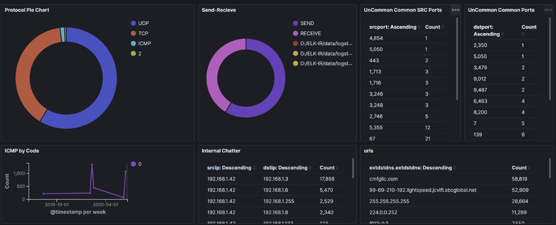
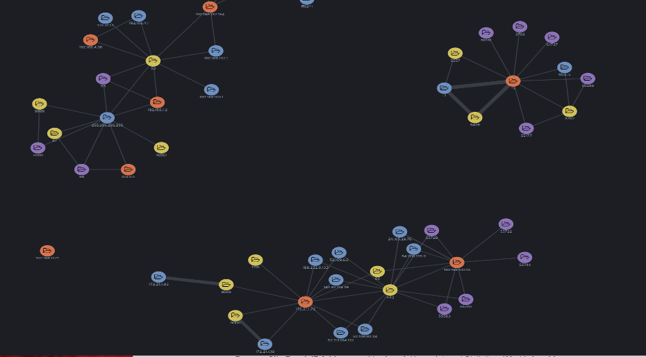

# REVENANT
*** update confirmed working with logstash 7.12 no change to instruction ***

> Check out the Overview-doc.docx for a quick overview with pics and pics below

Yes, I know I can put all that in this readme...one day it will happen.

# Welcome
## Intro

## Instructions

This is ready to use for anyone who wants to analyze their local fw logs or collected fw logs from windows devices.

### Setup
1. Download or clone this repo to a folder called ELK-IR
2. Download logstash 7.7.x from elasticsearch's website for your platform. You do not need to install unless you want to consistenly read your fw log in that case it will work just fine.
3. Put the unpacked logstash folder in the ELK-IR folder
4. Replace logstash.conf in the "config" folder of logstash with the logstash.conf from this repo.
5. Copy the mappings from the windowsfw.template file into a new index template called windowsfw-*, use dev tools to creat the new template.
6. Either make a copy or take note of the location of the fwlog you want to analyze.
7. Edit the powershell script Powershell-data-pull.ps1 to reflect the path to your pfirewall.log file in the beginning and a new folder called "data/logstash-dump" in the ELK-IR folder.
8. Run the powershell script, it will generate a csv in the desired output folder.
9. Now open the logstash.conf file and edit the path of the file input at the top to reflect the path to the csv you just created in "data/logstash-dump".
10. Input the location and credentials of the elasticsearch endpoint as well and the index starting with windowsfw- to match the template!
11. Run > ./bin/logstash -f ./config/logstash.conf
12. Log into you kibana instance and profit!

Upload the included vizualization and dashboard files if you like.

